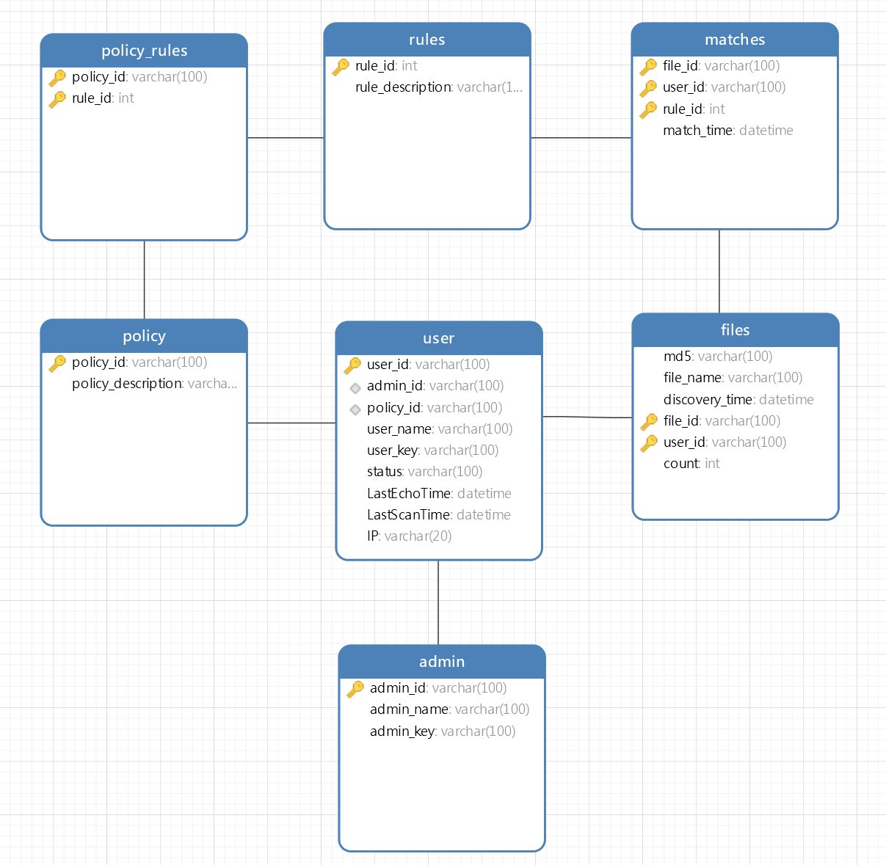

# repository1

## 食用指南

在frontend文件夹下：

安装module：

```bash
npm install
```

运行：

```bash
npm run dev
```

然后运行后端文件：
\backend\backstage.py (页面后台)
\app.py (客户端连接)
\rabbitmq.py (接收文件上报)

访问[http://localhost:9528](http://localhost:9528)

数据库结构：



## 请不要往github上塞module
